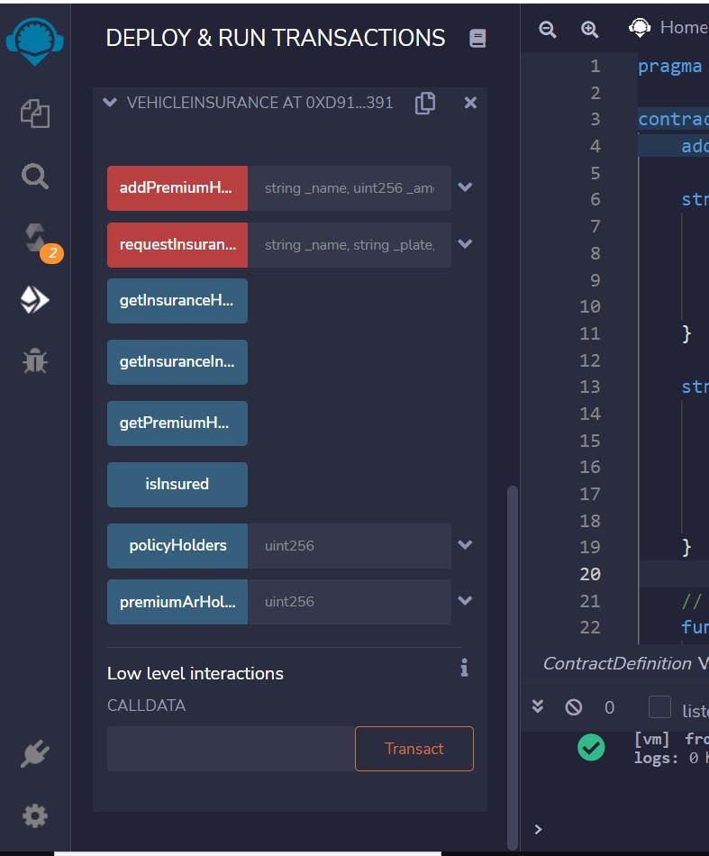
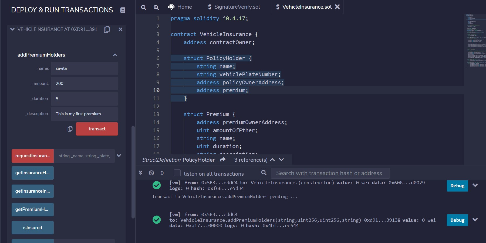
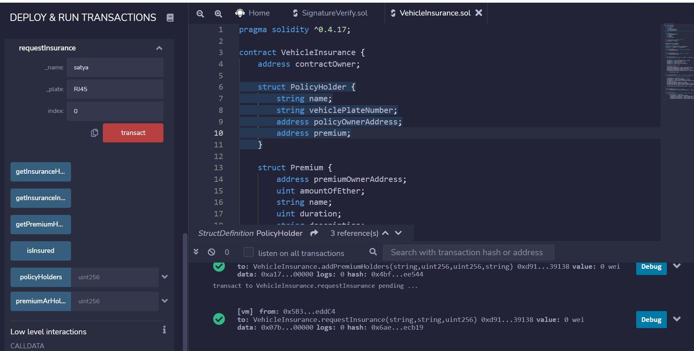
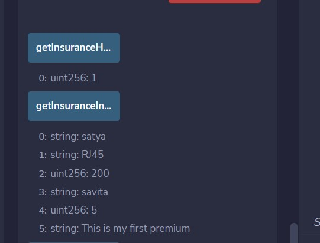
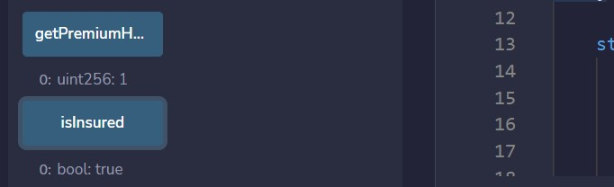
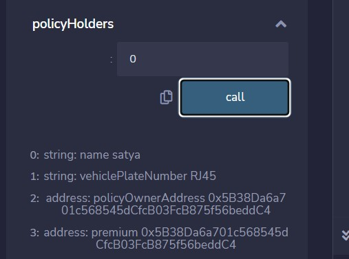
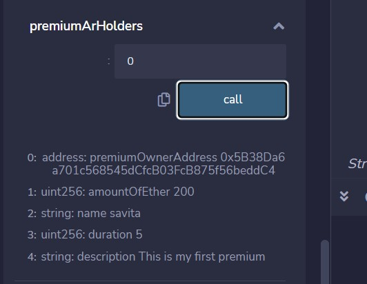

### VehicleInsurance
A Blockchain Project
• functions : addPremiumHolders, requestInsurance, getInsurance , getPremium , isInsured , policyHolders , premiumArHlders
 
 
### Prerequisites :
• Remix ide
 

### Build and Run Application
It requires remix ethereum ide . Follow this steps to get Working Project!
• Clone this repository or download file
• Extract zip if downloaded code
• Open project in remix ide
• Hit compile button and deploy  !

### WORKFLOW:
• Firstly we will claim new insurance package. 
• Import request insurance (for the new user). 
• Import new insurance offer ( Add Premium ). 
• Display no. of insurance holders. 
• Display no. of premium holders. 
• If transaction is successful then get insurance information. 
• Now we can check policyholders detail according to their index. 
• After that we can also check premiumArHolders detail according to their index. 

### Overview of project : 

### addpremiumHolders function :-
• This function adds premium details like name , amount of ether, duration of premium and description of premium.  

### requestInsurance function :-
• This function taking the details of new user who is taking insurance for the first time. 
• It will contains details like name, vehicle plate number, index . 
• Then we will transact the details to the insurance company. 
 
 
 
### getInsuranceHolders and getInsuranceInfo function :- 
• getInsuranceHolders function gives the details of number of insurance holders in the insurance company. 
• getInsuranceInfo function gives the details of last transacted user information if transaction is successful. 
 
 

### getPremium & isInsured function :-
• getPremiumHolders function gives the details of number of premium holders in the insurance company. 
• isInsured function give us the detail that transaction is successful or not.   
 

### policyHolders and PremiumArHolders function :- 
      

